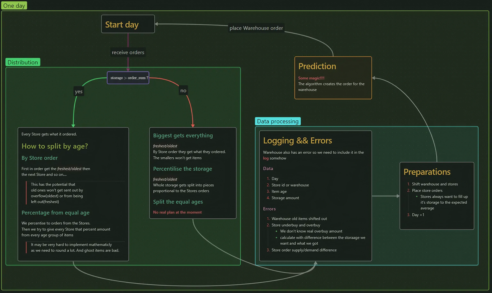

# Raktár előrejelző dokumentációja

## A program célja
A program célja a raktárban lévő árukészletek menedzselése, a rendelés mennyiségének t+4 napra prediktálása.

## A környezet
A megerősítő tanulás ágense számára létrehoztunk egy környezetet, melyben egy központi raktár, és az alá tartozó boltok találhatóak. A raktár célja, hogy minden nap elég áru legyen, hogy a boltok rendeléseit kielégíthesse. A boltok minden nap a másnapi fogyás várható értékére egészítik ki saját árukészletüket.

## A környezet pontos felépítése
A raktárban egy vektorban táruljuk a rendelt áru mennyiségét, ezzel szimulálva az időbeli eltolódást a boltok és a raktár között. A vektorba minden nap bekerül a raktár által rendelt mennyiség, valamint kiosztásra kerül a boltok között a négy nappal ezelőtt rendelt összes áru. A boltokban az árut szintén vektorokban tároljuk, ahol az indexek az áru korát (hány napja érkezett a boltba) jelzik.

## Tesztelés
A tesztelés során a boltok eloszlásából húzunk az aznapi fogyasztásra, majd nap végén az adott bolt a másnapi várható fogyasztás értékére próbálja meg kiegészíteni saját árukészletét. Ezt a rendelést továbbíta a központi raktár felé, ahol ennek függvényében szétosztásra kerül a korábban az adott napra megrendelt összes áru. A raktár a nap végén rendel, az általa rendelt áru csak négy nap múlva kerül a boltokba kiszállításra. Az áruk kiosztására több módszer is lehetséges. Bővebben a [folyamat](#tesztelés-folyamata) ábrán lehet róla olvasni. 

## Tesztelés folyamata
Ábrazoljuk egy nap szimuláció lefolyását a modellben.

## Hiba 
Hiba lehet többrétü. Mivel a boltokban és a raktárban is korok szerint tárolunk így mindekttőnél lehet hibaként kezelni a bennük maradt áru mennyiségét. Kor szerint lehet őket súlyozni is. Az olyan árut amit megvettek **volna** a való életben viszont nem lehet kezelni mert azt nem lehet tudni. Bizonyos kor után árukat kilehet dobni mert túl öregek. Az ilyet is lehet hibaként kezelni. Összeségében a kidobott áru mennyiségét kell minimalizálni különböző stratégiák mentén.

## Predikció
A raktár rendelésének optimalizálása a fő cél. A predikcióhoz szükséges bemenő paraméterek a boltok várható eloszlásai négy nap múlva, valamint a boltok adott pillanatbeli árukészletei és korábbi napok adatai is. A modell célje ezen inputok segítségével az optimális rendelendő mennyiség prediktálása.

## További célok
### Vásárlói szokások
Jelen pillanatban a vásárlói szokások abban nyilvánulnak meg, hogy mindig a legfrissebb árut szeretnék megvásárolni, ám később szeretnénk beépíteni, hogy lehetőség legyen ettől eltérő szokásokkal való tesztelére is.
### Lejárati idő
Mivel a boltokban napra pontosan tároljuk, mikor érekezett a termék, így hozzá lehet rendelni minden termékhez egy dátumot, mely után az adott termék mát nem kerülhet eladásra. Ezen termékek számát természetesen a hiba számolásába is be kell építeni. Ugyanezt lehet alkalmazni a raktárra is.

## Lehetséges egyéb változtatások
A mostani programban a központi raktár minden esetben kiosztja a nála lévő árut, így a boltok általában nem pontosan annyit kapnak, mint amennyit rendeltek. Ezzel ellentétben megvalósítható, hogy a "maradék", rendeléseken felüli áru nem kerül a boltokban kiszállításra, hanem a raktárban marad, és a következő rendelésekkor ez az áru is kiosztásra kerül. Ebben az esetben viszont fel kell állítani valamiféle fontossági sorrendet a boltok között, hogy melyik üzlet kapja a firssebb árut.
